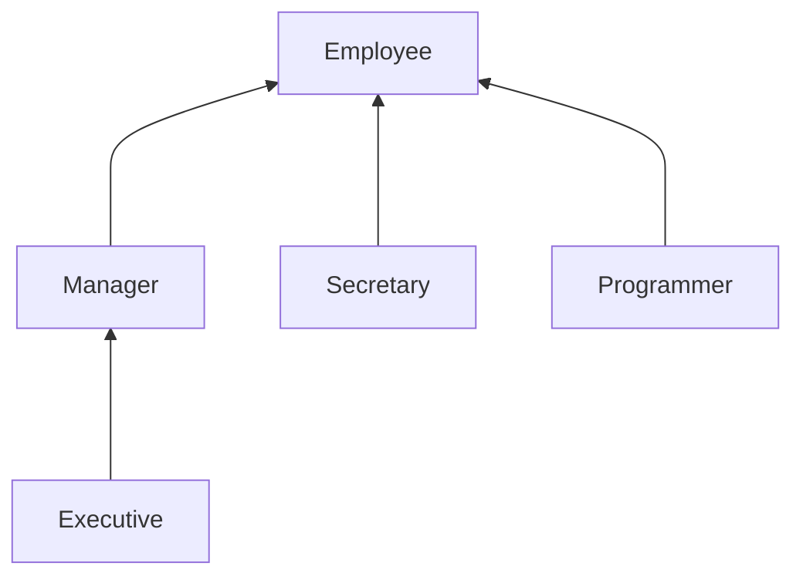

# Installation 
 install from openjdk 
# First Program 
```java
/**
 * File Name Must be Example.java
 */

public class Example {
    public static void main(String[] args) {
        IO.println("Hello World!!");

        String name = IO.readln("What Your Name? ");

        IO.println("नमस्ते " + name);

    }
}

```
## Java Listed Keywords 
Keywords are reserves words that have a predefined meaning 

java has total 53 Keywords.


# Data Types, Variables and Arrays 
## Primitive Data Types
- **Integers**: java have 4 types of integers

| Name    | Size(bit) |
| ------- | --------- |
| `long`  | 64        |
| `int`   | 32        |
| `short` | 16        |
| `byte`  | 8         |
```java
int x = 26 
int x = 0b11010 
int x = 0x1b
int x = 124_134_123 // Value of the x will be 124,134,123.  '_' will be ignored
int x = 124__134__123 // value will be 124,134,123 as more then one '_' is permissable 
int x = 0b01010__01010__01010 // is still valid as '_' will be ignored
```
- **Floating Points Type:** 

| Name     | Size(bits) |
| -------- | ---------- |
| `double` | 64         |
| `float`  | 32         |

```java
double x = 3.14159 
double x = -0.667
/** e or E followed by number represent 10 ^ {number}*/
double x = 6.022E23 // Valid 6.023 * 10^23 *
double x = 314159E-05 // valid 3.14159
double x = 2e100  // valid 2*10^100

/**
Hexadecimal Floating-point 
*/
double x = 0x12.2P2 // 0x12.2p2 both are valid hexadecimal representation. 

double x = 123_143.02 // is valid and equal to 123,143.02 as underscore will be ignored 
if (x== Double.NaN) // is never true 
if(Double.isNan(x)) // check whether x is "not a number"
```
- **Characters:** java store characters in `char`. It use Unicode to represent characters. so it's size is 16 bit (2 Byte) 

| Escape Sequence | Name            | Unicode Value |
| --------------- | --------------- | ------------- |
| \b              | Backspace       | \u0008        |
| \t              | Tab             | \u0009        |
| \n              | Line feed       | \u000a        |
| \r              | Carraige Return | \u000d        |
| \f              | Form feed       | \u000c        |
| \\"             | Double quote    | \u0022        |
| \\'             | Single quote    | \u0027        |
| \\\             | Blackslash      | \u005c        |

> [!CAUTION] 
> Unicode excape sequences are processed before the code is parsed. For example 
> "\u0022 + \u0022" is not a string consisting of a plus sign surrounded by quotation marks (U+0022). Instead the \u0022 are converted into " before parsing, yielding "" + "" or an empty string.
> // \u000A is a newline 
> yields to syntax error as \u000A is replaced with new line
> // look inside c:\users 
> also yields a syntax error because \u is not followed by four hex digits

- **Boolean:**  size 1 bit . only have two possible value `True` or `False` 

## Variable
**Declaration:** `type identifier[ = value] [, identifier [= value]....];` ex. `int a , b , c= 10 ;`

## Type Castings 
### Automatic Type Casting 
- if two types are compatible, then java will perform the conversion  automatically 
- The destination type is larger then source type. 
### Casting Incompatible Types 
If The Type Conversion is incompatible then we need to explicitly type conversion. 
	(target type) value
	Ex: int a= 300; byte b ; b = (byte) a ;
> Note : In Explicit type casting they will convert the value different way for different things 
> Like for 
> 1. Big size Integer to small size integer it will  reduce by modulo operation 
> 2. For floating-point to integer  first it will convert to nearest small integer (**ceil**) then it will reduce module to the target type range .

### Type Promotion Rule
1. In Java Expression if  automatically promotes to a larger size if at any time it exceed the current limit. 
2. If any one of highest promotion type are present in the expression then whole expression is promotes to the highest promotion type. 
**Promotion Hierarchy:** `double > float > long > int >  (short , char) > byte`

## Type Inference(`var`)
- `var` is reserved word not a keyword (means we can declare a variable name `var` also)
- `var` can only used as a local variable and need to initialize immediately. 
- `var` is decided in compile time and change it's to the actual type.
Example 
```java
var var = 1 ;
var myArray = new int[10] ;
var i = True ? Integer.valueOf(1) : "ABC" ;
```
#### Restriction On 'var'
invalid var uses
```java
var counter ;
var[] myArray = new int[10]
var myArray[] = new int[10]
var myArray = {1,2,3}
```

### Operators
- Arithmetic Operators (+, - , / , * , % )
- Assignment (=) , binary Assignment( x += y -> x= x+ y)
- Increment and Decrement Operators(++ , --)
- Relation and `boolean` Operators(== , != , > , >= , < , <= , && , || )
- Bitwise Operators (& , | , ^ , ~ , <<(Left  Shift), >> (Right Shift except sign bit) , >>>(Right Shift with sign bit shift))
> [!Caution]
>  The right-hand argument of the shift operators is reduced modulo 32 (unless the left-hand argument is a `long`, in which case the right-hand argument is reduced modulo 64). For example, the value of `1 << 35` is the same as `1 << 3` or `8`.
- Conditional/Ternary  Operators  ($conditional ? Expression_1:  Expression_2$)
- Switch Expression 
	```java
	String season = switch(seasoneCode){
		case 0 -> "Spring" ;
		case 1 -> "Summar" ;
		case 2 -> "Fal" ;
		case 3 -> "Winter" ;
		default -> "???"
	}
	int numLetters = switch(seasonName){       
	case "Spring", "Summer", "Winter" -> 6;
	case "Fall" -> 4;
	default -> -1;
	};
	//switch value. For example: 
	enum Size { SMALL, MEDIUM, LARGE, EXTRA_LARGE }; . . . 
	Size itemSize = . . .; 
	String label = switch (itemSize){       
		case SMALL -> "S"; // no need to use Size.SMALL       
		case MEDIUM -> "M";       
		case LARGE -> "L";       
		case EXTRA_LARGE -> "XL";    
	}; // No need to add default since there was a case for each possible value

	```
> [!Caution]
> A switch expression with integer or string operand must always have a default since it must yield a value no matter what the operand value is

# Class
A class is a blueprint or template used to create objects. It define custom data type by grouping related data (instance variable) and behaviors(methods) into a single unit.
```
modifiers class classname{
type instance-variable1 ;
type instance-variable2
 .
 .
 .
type instance-variableN ;
type methodName1(arguments){
// body
}
type methodName2(arguments){
// body
}
.
.
.
type methodNameN(arguments){
// body
}

}
```

example 
```java
class Box {
double width;
double height ;
double depth ;
}
```
we can create an **instance/objects** of class  by using new keyword 
```java 
Box b1 = new Box() ;
```

> [!Note]
> Hare `b1` is a reference variable that refer to the Box object.  so if we assign `Box b2 = b1` , `b2` is still refer to the same object also ;
> a Variable can hold reference  to an object or the spacial value `null` to indicate the absence of an objects

>[!Caution] 
> ##### Working With `null` reference
> If you apply a method to a `null` value a `NullPointerException` occurs. If the program does not "catch" an exception, it is terminated. 

## Call by Value Vs Call by Reference 
**Primitive types are always passed by value .**
```java
// Primitive types are passed by value.
class Test {
void meth (int i, int j) {
i *= 2;
j /= 2;
}
}
class CallByValue {
public static void main(String[] args) {
	Test ob = new Test();
	int a = 15, b = 20;
	System.out.println("a and b before call: " + a + " " + b); 
	// a and b before call: 15,20
	ob.meth(a, b);
	System.out.println("a and b after call: " + a + " " + b);
	// a and b after call: 15,20
	}
}
```
**Objects are always passed by their reference**
```java
class Test {
int a, b;
Test (int i, int j) {
a = i;
b = j;
}
// pass an object
void meth (Test o) {
o.a *= 2;
o.b /= 2;
}
}
class PassObjRef {
public static void main(String[] args) {
	Test ob = new Test (15, 20);
	System.out.println("ob.a and ob.b before call:"+ ob.a + " " + ob.b);
	// a and b before call: 15,20
	ob.meth (ob);
	System.out.println("ob.a and ob.b after call:" + ob.a + " " + ob.b);
	// a and b after call: 30,10
	}
}
```

For Return type same thing also thing happened ;
> [!Caution]
> Be careful not to write accessor methods that return references to mutable objects.
> As it's a reference type, changing in one reference can changed all the reference 
> ```java
> class Employee {
>     private Date hireDay;
>      . . .
>      public Date getHireDay()    
>      {       
>      return hireDay; // BAD    
>      return (Date) hireDay.clone() // Good
>      }    
>      . . . 
> }
> ```
## Constructors 
Constructor are just like a method that is invoke immediately upon creation. 
- it has the same name as class 
- it does not have any return type  not even void. 
- it can only be called  one time at the time of creation.
- all the class have a default constructor 
```
class ClassName {
ClassName(parameterList){ 
// body
}
}
```
If a constructor have parameter we call it **Parameterized Constructor**. 
A Class have more then one constructor with different parameter list  and it called **Constructor Overloading**. 
### `this` Keyword 
`this` can be used inside any method or constructor  to refer to current **objects/instance** .

Example : 
```java
class Box {
double width;
double height ;
double depth ;
Box(double w, double h , double d){
	this.width = w ;
	this.height = h ;
	this.depth = d ;
}
double getVolume(){
return this.width * this.height * this.depth ;
}
}
```

## Method Overloading
In Java, it is possible to define two or mire methods within the same class that shared the same name, **as long as their parameter declarations are different.** It's called method overloading . it's one of the way to support polymorphism. 
- Java use **type and/or number of arguments** to determine which version of method to actually call. 
- **Return Type** of method is insufficient to distinguish two versions of a method

Example :
```java
public class DemoOverloading {
    void test() {
        System.out.println("called test() with no args");
    }

    void test(int a) {
        System.out.println("called test(int a) with args:" + a);
    }

    void test(double a, double b) {
        System.out.println("called test(double a, double b) with args:" + a + " " + b);
    }

    void test(double a) {
        System.out.println("called test(double a) with args:" + a);
    }

    public static void main(String[] args) {
        int a_ = 10, b = 20;
        double a = 10.05;
        DemoOverloading obj = new DemoOverloading();
        obj.test(); // called test() with no args
        obj.test(a_); // called test(int a) with args:10
        obj.test(a); // called test(double a) with args:10.05
        obj.test(a, b); // called test(double a, double b) with args:10.05 20.0  
				    // Auto type casting
    }
}
```

## Constructors Overloading 
Same like method overloading we can overload a constructor methods
```java
class Box{
	double width;
	double height;
	double depth;
	Box(){
		width =  height = depth = -1 ;
	}
	Box(double value){
		width =  height = depth = value ;
	}
	Box(double w, double h, double d){
		width = w ;
		height = h; 
		depth = d;
	}
}

```
By passing the arguments it will called the respected constructor 
>[!Note] 
>You Can also call different constructor in the constructor also  by using `this` keyword 
>But it needs to be first instruction of constructor and only once time.
>example.
```java
class Demo {
Demo(){
	System.out.println("Default Constructor Called") ;
}
Demo(int a ){
	this() // Called Demo() constructor
	System.out.println("Parametarise Constructor Called") ;
}
public static void main(){
	Deom obj = new Demo(2) ;
	/* Output: 
	Default Constructor Called
	Parametarise Constructor Called
	**/
}
};
``` 

## Access Modifier 

| Access Modifier                  | `public` | `protected` | `default` | `private` |
| -------------------------------- | -------- | ----------- | --------- | --------- |
| ***within Class***               | ✅        | ✅           | ✅         | ✅         |
| ***Same Package***               | ✅        | ✅           | ✅         | ❌         |
| ***Subclass (Outside Package)*** | ✅        | ✅           | ❌         | ❌         |
| ***Everywhare***                 | ✅        | ❌           | ❌         | ❌         |
## Understanding `static` 
- **Static Fields:** If you define a fields with `static` keyword the field is not present in the objects of the class. Instead it will create only one single copy of each static field when the class is loaded. 
- **Static Method:** Static Methods are methods that do not operate on objects. Static methods can access only all the static methods and static variables of this class. It can't access this or super keyword as it's does not belongs to the object/instance .
- **Static Block:** Static Block are used to executed exactly once when the class is first loaded. In static block you can only access the static method and static variables of this class .

>[!NOTE]
>In JVM class are loaded when first time we are accessing the class  (like for creating new objects or accessing static fields or methods)

## `final` Keyword
- **Final Field:** A field can be declared as `final` . Doing it prevents from being modified, making it essentially a constant. This means we must initialize a final field when it's declared. it can be done by two ways : 
	1. initialize it when it's declared or 
	2. assign it within constructor. 
- **Final Methods:** A final methods can't be override by inherited class 
- **Final Class:** A final class can't be inherited by other class 

## Command-Line Arguments 
A command-line argument is the information that directly follows the program’s name on the command line when it is executed. To access the command-line arguments inside a Java program is quite easy—they are stored as strings in a String array passed to the args parameter of `main()` 
Example :
```java
class CommandLine{
	public static void main(String[] args){
		for(int i = 0 ; i < args.length ; i++)
		System.out.printf("args[%d]:\t%s\n" , i,args[i]) ;
	}
}
/* java CommandLine This is a test 100 -1
output : 
args[0]: This
args[1]: is 
...
args[5]: -1
```

## Variable Length Arguments 
Modern versions of Java include a feature that simplifies the creation of methods that need to take a variable number of arguments. This feature is called *varargs*, and it is short for variable-length arguments. A method that takes a variable number of arguments is called a *variable-arity method,* or simply a *varargs* *method*.
In legacy code we used array as a arguments to passed variable length arguments. Nowadays we use `...` to specify the variable length 
> [!Note]
> 1. Remember The varargs parameter must be last. 
> 2. There must be only one varargs parameter, the attempt to declare the second varargs parameter is illegal.
> 3. You can also overload the varargs methods also.

> [!Caution]
>Overloading a varargs method can lead to a ambiguity also. as it's a possible to create ambiguous call to an overloaded varargs method.


## Package
A package in Java is a mechanism to encapsulate a group of related classes, interfaces, and sub-packages. Package help in organizing the code, **preventing naming conflicts**, and providing controlled access to classes and interfaces.
### Class Importation
Class Importation is used to access the public classes of another package.
There is two ways we can use public classes of another packages
- Using fully qualified name: `java.time.LocalDate today = java.time.LocalDate.now()`
- Using `import` keyword at the top of the source file(but below any package statement) 

You can import all the classes of a package, or you can import only a specific Class form a package.
Example:

```Java
import java.time.*; // Import all the classes of java time package 
import java.util.ArrayList; // Import only the Arraylist
/* 
NOTE: You Can only use * notation to import single packages
You can't import all packages with java prefix
// import java.*    INALID!!
// import java.*.*  INVALID!!
*/
```

Suppose you write a program that imports both packages.

```java
import java.util.*;
import java.sql.*;
Date today; // ERROR--java.util.Date or java.sql.Date?
```

If you now use the Date class, you get a compile-time error:  
The compiler cannot figure out which Date class you want. You can solve this problem by adding a specific import statement:  
```java
import java.util. *
import java.sql.*;
import java.util.Date; 

Date today ; //NO-ERROR
```

### Static Imports
A form of the `import` statement permits the importing of static methods and fields, not just classes
# Inheritance
Inheritance in Java is an Object-Oriented Programming (OOP) feature that allows one class (subclass/child) to acquire the properties and behaviors of another class.

```java
//// This class will be used to understand Inhertance ;
import java.time.LocalDate;

class Employee {
    private String name ;
    private int salary ;
    private LocalDate hireDate ;
    Employee(String name , int salary , int year , int month , int day){
        this.name = name ;
        this.salary = salary ;
        this.hireDate = LocalDate.of(year, month, day) ;
    }
    public String getName() {
        return name;
    }
    public LocalDate getHireDate() {
        return hireDate;
    }
    public int getSalary() {
        return salary;
    }
}

```

# Class , Subclass, Superclass
### Defining Subclass

```java
Syntex: <acces-modifier> class <subclassname> extends <superclassname> 
public class Manager extends Employee
private double bonus;
...
public void setBonus(byte byPercent) (
this.bonus = bonus;
)
```

In OOPs, **subclass** is a class that inherits attributes and methods from another class, known as a **superclass**.
In Java we use `extends` keywords to inherit the class.
All the properties of super class is present in subclass (except `private` methods/fields. they are present but not accessible ) and we can also add extra fields and/or methods to the subclass.
>[!Note]
> Derived/Sub class didn't inherits the static members, as static member are belongs to class not the objects. 
### Overrideing Methods 
In Manager class some of the methods like `getSalary` is not appropriate so we need supply a new method to override this method 
we can override a method by redefine it.
```java
class Manager extends Employee {
...
int getSalary(){
	return salary + bonus
}
}
```
but salary is private member so we don't have the access and we can't use `return getSalary() + bonus` also as it will call the same override function. 
To overcome this problem we will use `super` keyword. 
```
int getSarary(){
	return super.getSalary() + bonus ;
}
```

Using `super.getSalary()`  we are telling to use the Employee class `getSalary` methods.
***The `super` keyword is a spacial keyword that directs the compiler to invoke the superclass methods***
>[!Caution]
>When you override a method, the subclass method must be at least as visible as the superclass method. In particular, if the superclass method is public, the subclass method must also be declared public. It is a common error to accidentally omit the public specifier for the subclass method. The compiler then complains that you try to supply a more restrictive access privilege.

>[!Note]
>If we override a method it's best to use `@Override `annotation at top of the override function. if you make a mistake such as a typo in the name or an incorrect parameter list, the compiler will generate an error immediately. Without this annotation, the compiler would simply treat your mistypes method as a new, additional method, often leading to subtle bugs at runtime. 
>```java
>@Override 
>int getSalary()
>...
>```
### Subclass Constructor 
To complete the subclass let us supply the constructor
```java 
public Manager(String name , int salary , int year , int month , int day){
    super(name, salary, year, month, day);
    bonus = 0 ;
}
```
The instruction `super(name,salary,year,month,day)` is shortend of 'Call the constructor of Employee' with name , salary,  year month and day. ***If we don't provied the super instruction it will call the default constructor of superclass if not present it will show a compile error.*** 
> [!Note]
> Recall that the `this` keyword has two meanings: to denote a reference to the implicit parameter and to call another constructor of the same class. Likewise, the `super` keyword has two meanings: to invoke a superclass method and to invoke a superclass constructor. When used to invoke constructors, the `this` and `super` keywords are closely related. ***The constructor calls can only occur as the first statement in another constructor. The constructor parameters are either passed to another constructor of the same class (`this`) or a constructor of the superclass (`super`).***
### Inheritance Types in Java
- **Single Inheritance**
    - **Structure:** One child class inherits from exactly one parent class.
    - **Example:** `class Manager extends Employee`.
- **Multilevel Inheritance**
    - **Structure:** A class is derived from another derived class, forming a chain.
    - **Example:** `class Executive extends Manager`, where `Manager extends Employee`.
- **Hierarchical Inheritance**
    - **Structure:** Multiple child classes inherit from a single parent class.
    - **Example:** `class Manager extends Employee` and `class Programmer extends Employee`

Inheritance Graph: 


### Polymorphism
The “is–a” rule states that every object of the subclass is an object of the superclass. For example, every manager is an employee. 

```java
public class InhertanceDemo {
    public static void main(String[] args) {
        Manager boss = new Manager("Boss", 70000, 2010, 5, 4);
        boss.setBonus(15000);

        Employee[] emp = new Employee[3];
        emp[0] = boss;
        emp[1] = new Employee("Employee 1", 35000, 2015, 3, 2);
        emp[2] = new Employee("Employee 2", 50000, 2012, 3, 2);

        for (Employee e : emp) {
            System.out.println(e.getName() + " has salary: " + e.getSalary());
        }
    }
}
OUTPUT: 
Boss has salary: 85000
Employee 1 has salary: 35000
Employee 2 has salary: 50000
```
 
Hare `emp[0]` is an `Employee` superclass and still we can assign the subclasss 'Manager' to  it.
also  hare `e` can be `Manager` or `Employee`.  When `e` refers to an `Employee` object, the call `e.getSalary()` calls the `getSalary` method of the `Employee` class. However, when e refers to a `Manager` object, then the `getSalary` method of the `Manager` class is called instead. The virtual machine knows about the actual type of the object to which `e` refers, and therefore can invoke the correct method.

The fact that an object variable (such as the variable `e`) can refer to multiple actual types is called polymorphism. Automatically selecting the appropriate method at runtime is called dynamic binding.

In the Java programming language, object variables are polymorphic. A variable of type Employee can refer to an object of type Employee or to an object of any subclass of the Employee class (such as Manager, Executive, Secretary, and so on).
In this case, the variables `staff[0]` and boss refer to the same object. However, **`staff[0]` is considered to be only an Employee object by the compiler.**
That means 
```java
boss.setBonus(10000) // OK
emp[0].setBonus(10000) // Error as in compile time it consider Employee type
```

However, you cannot assign a superclass reference to a subclass variable. For example, it is not legal to make the assignment
```java
Manager m = emp[i] // error 
```
Because not all employee are manager. If this assignment were to succeed and m were to refer to an Employee object that is not a manager, then it would later be possible to call `m.setBonus(. . .) `and a runtime error would occur.

>[!Caution]
>In Java, arrays of subclass references can be converted to arrays of superclass references without a cast. For example, consider this array of managers
>```java
>Manager[] managers = new Manager[10];
>```
>It's legal to convert this arrays to employee 
>```java
>Employee[] staff = m ;
>```
>Sure, why not, you may think. After all, if `managers[i]` is a `Manager`, it is also an `Employee`. But actually, something surprising is going on. Keep in mind that `managers` and `staff` are references to the same array. Now consider the statement
>```java
>staff[0] = new Employee("Harry Hacker", . . .);
>```
>compiler will cheerfully make the assignment. but `staff[0]` and `manager[0]` are the same reference, so it looks as if we managed to smuggle a mere employee into the management ranks. That would be very bad calling `managers[0].setBonus(1000) `would try to access a nonexistent instance field and would corrupt neighboring memory.
>
>To make sure no such corruption can occur, all arrays remember the element type with which they were created, and they monitor that only compatible references are stored into them. For example, the array created as `new Manager[10]` remembers that it is an array of managers. Attempting to store an `Employee` reference causes an `ArrayStoreException` 
### Casting 
Casting is the process to convert from one type to another.
```java
var staff = new Employee[3]; 
staff[0] = new Manager("Carl Cracker", 80000, 1987, 12, 15); 
staff[1] = new Employee("Harry Hacker", 50000, 1989, 10, 1); 
staff[2] = new Employee("Tony Tester", 40000, 1990, 3, 15);
```
hare we casting Manager(subclass) to Employee(superclass). it's implicit casting.
The compiler checks that you do not promise too much when you store a value in a variable. If you assign a subclass reference to a superclass variable, you are promising less, and the compiler will simply let you do it. If you assign a superclass reference to a subclass variable, you are promising more. Then you must use a cast so that your promise can be checked at runtime.
```java
Manager boss = (Manager) staff[1] //ERROR
```
compiler  will compile it without error.  When the program runs, the java runtime system notices the broken promise and generates a `ClassCastException`.  Thus it is good programming practice to find out whether a cast will succeed before attempting it.  Simply use `instanceof` operator. for example
```java
if (staff[i] instanceof Manager){
	boss = (Manager)staff[i] ;
	...
}
```
Finally, the compiler will not let you make a cast if there is no chance for the cast to succeed. For example, the cast
```java
String c = (String) staff[i] // Compile Error
```
is a compile time error because `String` is not a subclass of Employee. 
To sum up: 
-  You can cast only within an inheritance hierarchy. 
-  Use `instanceof` to check before casting from a superclass to a subclass.
>[!Note]
>The test `x instanceof c` does not generate an exception if `x` is `null`. It simply return `false`. That make sense: `null` refers to no objects, so it certainly doesn't refer to an object of type c

Actually, converting the type of an object by a cast is not usually a good idea. In our example, you do not need to cast an `Employee` object to a `Manager` object for most purposes. The `getSalary` method will work correctly on both objects of both classes. The dynamic binding that makes polymorphism work locates the correct method automatically.
The only reason to make the cast is to use a method that is unique to managers, such as `setBonus`.
### Pattern Matching for `instanceof`
As of Java 16, there is an easier way. You can declare the subclass variable right in the `instanceof` test:
```java
if(staff[i] instanceof Manager boss){
	boss.setBonus(5000) ;
}
```

>[!Tip]
>In most situations in which you use `instanceof`, you need to apply a subclass method. Then use this “pattern-matching” form of `instanceof` instead of a cast.

When an `instanceof` pattern introduces a variable, you can use it right away, in the same expression:
```java
Employee e 
if (e instanceof Manager m && m.getBonus() > 10000) ...
```
Here is another example with the conditional operator:
```java
double bonus = e instanceof Manager m ? m.getBonus() : 0;
```
>[!Caution]
>As any local variable, the local variable defined by an `instanceof` pattern can shadow a field.
>```java
>class Value {    
>	private double v;    
>	public boolean equals(Value other){       
>	if (other123 instanceof LabeledValue v){
>		// v is the same as other123
>	}else {
>		// v denotes the field 
>	}
>```

## Abstract Class
An abstract class is class that declared `abstract` - it may or may not include abstract methods. abstract classed can't be instantiated but they can be sub-classed. 
***Abstract Methods*** is a method that is declared without an implementation. the subclass is required to override all the abstract methods of a  the abstract class. 
Example 
```java
abstract class Person {
private String name ;
Person(String name){
	setName(name) ;
}
public String getName(){
	return Name ;
}
public void setName(String name){
	this.name = name ;
}
abstract public void getDescription();
}
```

The following `Person` class is a  abstract class. and description is a abstract method.

## Sealed Classes 
Sealed classes and interfaces restrict which other classes or interfaces may extend or implement them.
### Declaring Sealed Classes
To seal a class, add the `sealed` modifier to its declaration. Then, after any `extends` and `implements` clauses, add the `permits` clause. This clause specifies the classes that may extend the sealed class.
```java
Syntex: <[OtherModifiers]> sealed class <className> <extends SuperClass><implements Interfaces> permits <[classes]>
// com/my/graph/
package "com.my.graph"
// Shape.java
public sealed class Shape permits Circle, Square, Rectangle {
}
// Circle
public final class Circle extends Shape {
	public double radius ;
}
// Square
public non-sealed class Square extends Shape {
	public double side ;
}
// Rectangle.java
public sealed class Rectangle extends Shape 
	permits FillRectangle {
	public double length, width;
	}
// FillRectangle.java
public final class FillRectangle {
	int red,green,blue ;
}
```
## Constraints on Permitted Subclasses 
Permitted subclasses have the following constraints:
- They must be accessible by the sealed class at compile time.
    For example, to compile `Shape.java`, the compiler must be able to access all of the permitted classes of `Shape`: `Circle.java`, `Square.java`, and `Rectangle.java` . In addition, because `Rectangle` is a sealed class, the compiler also needs access to `FilledRectangle.java`.
- They must directly extend the sealed class.
- They must have exactly one of the following modifiers to describe how it continues the sealing initiated by its superclass
    - `final`: Cannot be extended further
    - `sealed`: Can only be extended by its permitted subclasses
    - `non-sealed`: Can be extended by unknown subclasses; a sealed class cannot prevent its permitted subclasses from doing this    
	For example, the permitted subclasses of `Shape` demonstrate each of these three modifiers: `Circle` is `final` while `Rectangle` is sealed and `Square` is `non-sealed`.
- They must be in the same module as the sealed class (if the sealed class is in a named module) or in the same package (if the sealed class is in the unnamed module, as in the `Shape.java` ).
An important motivation for sealed classes is compile-time checking.
```
public String type(){
	return switch(this){
	case Circle j -> "circle";
	case Reactangle j -> "reactangle";
	case Square j -> "square" ;
	// No default needed hare 
	}
}
```


## `Object`: The Cosmic Superclass
The `Object` class is the ultimate ancestor—every class in Java extends `Object`. However, we never have to write. The ultimate superclass Object is taken for granted if no superclass is explicitly mentioned.
### Variables of Type `Object`
We can use a variable of type `Object` to refer to objects of any type:
```java
Objects obj = new Employee("Rohan",50000)
```
### The `equals` Method
The `equals` method in the `Object` class tests whether one object is considered equal to another.
```java
public class Employee{
	...
	@Override 
	public boolean equals(Object otherObject){
	//a quick test to see if the objects are identical
	if (this == otherObject) return true;      
	// must return false if the explicit parameter is null      
	if (otherObject == null) return false;      
	// if the classes don't match, they can't be equal      
	if (getClass() != otherObject.getClass())         
		return false;      
	// now we know otherObject is a non-null Employee      
	Employee other = (Employee) otherObject;      
	// test whether the fields have identical values
	return name.equals(other.name) && salary == other.salary
			&& hireDay.equals(other.hireDay) ;
	}
}
```
>[!Tip]
>To guard against the possibility that `name` or `hireDay` are `null`, use the `Objects.equals` method. The call `Objects.equals(a,b)` return `true` if both arguments are `null`, `false` if only one is `null`, and calls a.equals(b) otherwise. 
>so the last statement of `Employee.equals` method becomes 
>```java
>return Objects.equals(name, other.name)    
>	&& salary == other.salary
>	&& Objects.equals(hireDay, other.hireDay);
>```

When you define the `equals` method for a subclass, first call `equals` on the super-class. If that test doesn’t pass, then the objects can’t be equal. If the superclass fields are equal, you are ready to compare the instance fields of the subclass.
```java
public class Manager extends Employee {   
. . .   
public boolean equals(Object otherObject){      
	if (!super.equals(otherObject)) return false;      
	// super.equals checked that this and otherObject belong to the same class  
	Manager other = (Manager) otherObject;      
	return bonus == other.bonus;
	} 
}
```

Many programmer use an `instanceof`  test instead class:
```java
if(! (otherObj instanceof Employee)) return false ;
```
This leaves open possibility that `otherObj` can belongs to a subclass.

The Java Language Specification requires that `equlas` method has following properties:
- ***Reflexive:*** For any non-null reference `x`, `x.xequals(x)` should return `true`.
- ***Symmetric:*** For any references `x` and `y`, `x.equals(y)` should return `true` if and only if `y.equals(x)` return `true`.
- ***Transitive:*** For any references `x`, `y`, and `z`, if `x.equals(y)` returns `true` and `y.equals(z)` returns `true`, then `x.equals(z)` should return `true`.
- ***Consistent:*** If the objects to which `x` and `y` refer haven’t changed, then repeated calls to `x.equals(y)` return the same value.
- For any non-null reference `x`, `x.equals(null)` should return `false` ;
### The `hashCode` Methods
### The `toString` Methods

# Interfaces 
an _interface_ is a reference type, similar to a class, that can contain _only_ constants, method signatures, default methods, static methods, and nested types. Method bodies exist only for default methods and static methods. Interfaces cannot be instantiated—they can only be *implemented* by classes or _extended_ by other interfaces.
## Defining an Interface
An interface declaration consists of modifiers, the keyword `interface`, the interface name, a comma-separated list of parent interfaces (if any), and the interface body. For example:
```
public interface GroupedInterface extends Interface1, Interface2, Interface3 {

    // constant declarations
    
    // base of natural logarithms
    double E = 2.718282;
 
    // method signatures
    void doSomething (int i, double x);
    int doSomethingElse(String s);
}
```
The `public` access specifier indicates that the interface can be used by any class in any package. If you do not specify that the interface is public, then your interface is accessible only to classes defined in the same package as the interface.
**However a class can extend only one other class, an interface can extend any number of interfaces.** 
### The Interface Body 
The interface body can contain abstract methods, default methods, and static methods. An abstract method within an interface is followed by a semicolon, but no braces (an abstract method does not contain an implementation). Default methods are defined with the `default` modifier, and static methods with the `static` keyword. All abstract, default, and static methods in an interface are implicitly `public`, so you can omit the `public` modifier.

In addition, an interface can contain constant declarations. All constant values defined in an interface are implicitly `public`, `static`, and `final`. Once again, you can omit these modifiers.

### Resolving Default Method Conflicts 
What happens If same method is defined as a default method in one interface and then again as method of supperclass or another interface ?
1. **Superclass win**. If a superclass provides a concrete method, default methods with same name and parameter types simply ignored ;
2. **Interface clash**. If an interface provides a ***default method***, another interface contain a method with same name and parameter types ***(default or not)***, then  we must resolve the conflicts by overriding that method.
Example :
```java
interface Person {   
	default String getName() { return ""; }; 
} 
interface Named {   
	default String getName() { 
		return getClass().getName() + "_" + hashCode(); 
	} 
	/**
	String getName() ; //in this case also need to override.
	**/
}

class Student implements Person, Named {   
	public String getName() { 
		return Person.super.getName(); 
	}   
. . . 
}
```

## Lambda Expression
A *lambda expression* is, essentially, an anonymous (that is, unnamed) method. However, this method is not executed on its own. Instead it is used to implement a method define by a functional interface. 
### Syntax of Lambda Expression
Lambda expression have three parts 
	1. *lambda Parameters:*The left side specifies parameters list in a parentheses '()' that required by the lambda expression (if no parameter required then only the empty parentheses used )
	2.  *lambda operator:* `->`
	3. *lambda body:* Java defines two types of lambda bodies. one consists of a single expression, and the other type consists of a block of code
Example: 
```
()-> 123.45 // lambda expression takes no arguments and return a constant value. it similar to 
double myMeth(){return 123.45 ;}

(int n)-> (n%2)==0 // check n is even or not
```
### Functional Interface 
A *Functional Interface* is a interface that contains one and only one abstract method. thus *functional interface* typically represents single action. for example the standard interface **`Runnable`** is a functional interface that define only one method: **`run()`** 

You can supply a lambda expression whenever an object of an interface with a single abstract method is expected. such an interface called *functional interface*.
to demonstrate the conversion to a functional interface, consider the `Arrays.sort` method.  Its second parameter an instance of `Comparator`, an interface with single method. Simply supply a lambda: 
```java
Arrays.sort(words, 
(first,second)-> first.length() - second.length()
);
```
Behind the scenes, the `Arrays.sort `method receives an object of some class that implements `Comparator<String>`.

### Method References 
Sometimes, a lambda expression involves a single method. For example, suppose you simply want to print the event object whenever a timer event occurs. Of course, you could call
```java
var timer = new Timer(1000, event -> System.out.println(event));
```
It would be nicer if you could just pass the println method to the Timer constructor. Here is how you do that:
```java
var timer = new Timer(1000, System.out::println);
```
The expression `System.out::println` is a method reference. It directs the compiler to produce an instance of a functional interface, overriding the single abstract method of the interface to call the given method. In this example, an `ActionListener` is produced whose `actionPerformed(ActionEvent e)` method calls `System.out.println(e)`.
>[!Note]
>Like a lambda expression, a method reference is not an object. It gives rise to an object when assigned to a variable whose type is a functional interface.

**Variants of Method Referencing:**
	1. _object::instanceMethod_ : the method reference is equivalent to a lambda expression whose parameters are passed to the method. for example : `System.out::println` is equivalent to `x -> System.out.println(x)`
	2. _Class::instanceMethod_: the first parameter becomes the implicit parameter of the method. for example: `String::compareToIgnoreCase` is same as `(x,y)->x.comapreToIgnoreCase(y)`,
	3. _Class::staticMethod_: all the parameters passed to the static method. for example `Math::pow` is equivalent to `(x,y)->Math.pow(x,y)`
### Constructor References
Constructor references are just like method references, except that the name of the method is `new`
For example, `Person::new` is a reference to a Person constructor. Which constructor? It depends on the context.
```java
ArrayList names = . . .; 
Stream stream = names.stream().map(Person::new); 
List people = stream.toList();
```
in this example map method calls the `Person(String)` constructor for each element.

You can form constructor references with array types. For example, `int[]::new `is a constructor reference with one parameter: the length of the array. It is equivalent to the lambda expression `n -> new int[n].`
### Variable Scope 
Often, you want to be able to access variables from an enclosing method or class in a lambda expression. Consider this example:
```
public static void repeatMessage(String text, int delay{    
	ActionListener listener = event -> {          
		System.out.println(text);
		Toolkit.getDefaultToolkit().beep();       
	};    
	new Timer(delay, listener).start(); 
}

repeatMessage("Hello",1000) ;
```
Now look at the variable *text* inside the *lambda expression*. Note that this variable is not defined in the lambda expression. Instead, it is a parameter variable of the `repeatMessage` method.

To understand what is happening, we need to refine our understanding of a lambda expression. A lambda expression has three ingredients:
1. A block of code 
2. Parameters
3. Values for the *free* variables - that is the variables that are not parameters and not define inside the block of code.
In our example, the lambda expression has one free variable, text. The data structure representing the lambda expression must store the values for the free variables—in our case, the string "Hello". We say that such values have been captured by the lambda expression.

As you have seen, a lambda expression can capture the value of a variable in the enclosing scope. In Java, to ensure that the captured value is well-defined, there is an important restriction. In a lambda expression, you can only **reference variables whose value doesn’t change.** for example:
```java
public static void countDown(int start, int delay){    
	ActionListener listener = event ->{          
	start--; // ERROR: Can't mutate captured variable          
	System.out.println(start);
	};
	new Timer(delay,listener).start();
}
```
It is also illegal to refer, in a lambda expression, to a variable that is mutated outside. For example, the following is illegal:
```java
public static void repeat(String text, int count){   
	for (int i = 1; i <= count; i++){        
		ActionListener listener = event ->{              
			System.out.println(i + ": " + text);
			// ERROR: Cannot refer to changing i
		};   
		new Timer(1000, listener).start();   
	} 
}
```

The rule is that any captured variable in a lambda expression must be *effectively final.* An effectively final variable is a variable that is never assigned a new value after it has been initialized.

The body of a lambda expression has the same ***scope as a nested block.*** The same rules for name conflicts and shadowing apply.
```java
Path first = Path.of("/usr/bin");
Comparator<String>comp = 
	(first,second)-> first.length() - second.length() ;
	//ERROR: Variable first already defined.
```
Inside a method, you can’t have two local variables with the same name, and therefore, you can’t introduce such variables in a lambda expression either.

When you use the `this` keyword in a lambda expression, you refer to the `this` parameter of the method that creates the lambda. for example 
```java
public class Application{
	public void init(){
		ActionListener listener = event -> {
			System.out.println(this.toString());
			...
		}
		...
	}
}
```
hare `this.toString() `method calls the `toString` method of the `Application` object, not the `ActionListener` instance.

common *functional interface* :

| Functional Interface | Parameter Types | Return Types | Abstract Method Name | Description                                      | Other Methods                           |
| -------------------- | --------------- | ------------ | -------------------- | ------------------------------------------------ | --------------------------------------- |
| `Runnable`           | `none`          | `void`       | `run`                | Runs an action without arguments or return value |                                         |
| `Supplier<T>`        | `none`          | `T`          | `get`                | Supplies a value of type T                       |                                         |
| `Consumer<T>`        | `T`             | `void`       | `accept`             | Consumes a value of type T                       | `andThen`                               |
| `BiConsumer<T,U>`    | `T`, `U`        | `void`       | `accept`             | Consumes values of types T and U                 | `andThen`                               |
| `Function<T,R>`      | `T`             | `R`          | `apply`              | A function with argument of type T               | `compose`, `andThen`, `identity`        |
| `BiFunction<T,U,R>`  | `T`,`U`         | `R`          | `apply`              | A function with arguments of types T and U       | `andThen`                               |
| `Unary0perator<T>`   | `T`             | `T`          | `apply`              | A unary operator on the typе Т                   | `compose`, `andThen`, `identity`        |
| `Binary0perator<T>`  | `T`, `T`        | `T`          | `apply`              | A binary operator on the type T                  | `andThen`, `maxBy`, `minBy`             |
| `Predicate<T>`       | `T`             | `boolean`    | `test`               | A boolean-valued function                        | `and`, `or`, `negate`, `isEqual`, `not` |
| `BiPredicate<T,U>`   | `T`, `U`        | `boolean`    | `test`               | A boolean-valued function with two arguments     | `and`, `or`, `negate`                   |
